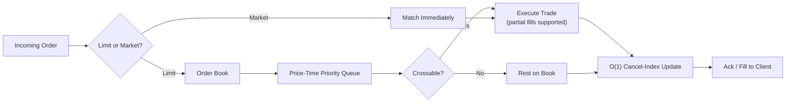
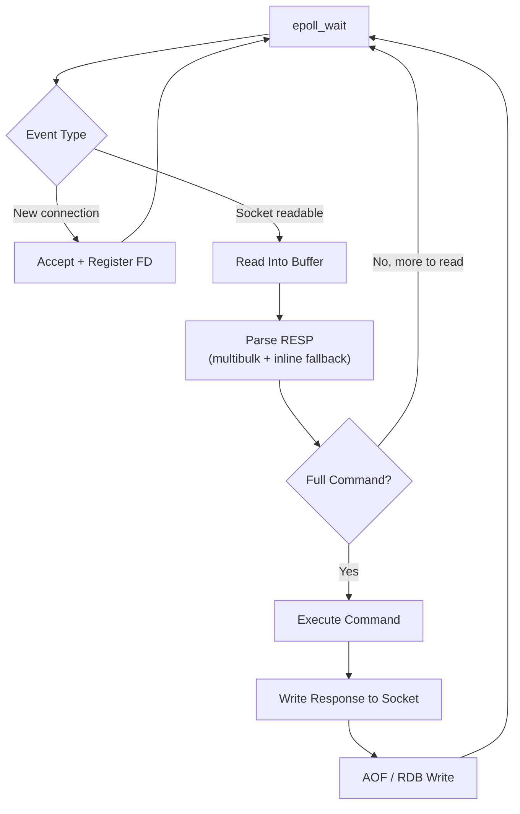

<div align="center">


<br/>


</div>

<div align="center">
<br/>
<i>"I'd rather understand how a system performs under load than assume it — so I built a Redis-style store and a matching engine myself, then benchmarked both. That's the whole pitch.</i>
<br/><br/>
</div>

---

```text
$ who-am-i

Pratik Borse — Systems Programmer (C++)
Real-Time Simulation Engineer · Pune, India


$ cat mission.txt

By day:
  Real-time Digital Twin simulations for CNC & robotic systems.

By night:
  Event loops. Wire protocols. Matching engines.
  Built from scratch because understanding the abstraction
  is more interesting than simply using it.


$ ls core/

redis-clone-cpp/
             └─ epoll reactor · RESP · AOF/RDB persistence

matching-engine-cpp/
             └─ price-time priority · 40K+ orders/sec · sub-2ms p99
```

---

## 🧪 Benchmarked, Not Assumed

Two systems. Built from the socket layer up. Proven under a load harness I wrote myself — because "should be fast" isn't a metric.

### ⚙️ matching-engine-cpp
*A low-latency limit order matching engine — price-time priority, proven under real concurrent load.*

- FIFO matching with partial fills, **O(1) order cancellation** via an auxiliary index
- A custom multi-threaded **TCP load-test harness** — real throughput and p50/p95/p99 latency, not guesses

**Sub-2ms p99 latency** at 100 concurrent clients, holding steady past **2,000,000** total orders processed.

| Concurrent Clients | Throughput |
|:---:|:---:|
| 10 | 40,739 orders/sec |
| 100 | **50,093 orders/sec** (peak) |
| 1,000 | 46,768 orders/sec |



**[→ github.com/Zepar99/matching-engine-cpp](https://github.com/Zepar99/matching-engine-cpp)**

<br/>

### 🗄️ redis-clone-cpp
*A Redis-style in-memory key-value store, built from raw sockets up.*

- Single-threaded **epoll** reactor — concurrent TCP clients, zero locks on the data store
- A real **RESP wire protocol** — multibulk parsing with partial-read handling, plus inline fallback
- **AOF + RDB** persistence, selectable at runtime (`--persistence=aof|rdb|both`)
- TTL/expiry via lazy deletion, with structured timestamped logging



**[→ github.com/Zepar99/redis-clone-cpp](https://github.com/Zepar99/redis-clone-cpp)**

---

<details>
<summary><b>🕹️ Before the Backend: Game Dev Era</b></summary>
<br/>

<table>
<tr>
<td width="50%">

**[The Dungeon Tale](https://github.com/Zepar99/The-Dungeon-Tale)**
Dungeon puzzle game — two players, one controller. Unity + C#.

**[Battle Tanks](https://github.com/Zepar99/Battle-Tank)**
3D tank combat. Unity + C#.

</td>
<td width="50%">

**[Duet Game](https://github.com/Zepar99/Duet-Game)** · 2D hyper-casual
**[Hill Climb](https://github.com/Zepar99/Hill-Climb)** · Physics racer
**[Paper Plane](https://github.com/Zepar99/Paper-Plane)** · 2D survival
**[The Explorer](https://github.com/Zepar99/The-Explorer)** · 2D platformer

</td>
</tr>
</table>

</details>

---

## 🧰 Toolchain

<p align="center">
  
  
  
  
  
  
  
  
</p>

---

## 📈 GitHub Activity

<table>
<tr>
<td width="60%">


</td>
<td width="40%">


</td>
</tr>
</table>

<p align="center">

</p>

---

## 🛠️ Currently Compiling

```bash
$ cat currently_focused_on.txt
├── DSA fluency — interview-speed pattern recognition
├── Multi-threaded concurrency patterns
├── Memory-safety tooling (sanitizers, testing)
└── Low-latency system design
```

---

<div align="center">

## 📡 Open a Connection

Always up for talking systems, latency budgets, or why your p99 looks like that.

<a href="mailto:pratikkborse@gmail.com"></a>
<a href="https://www.linkedin.com/in/pratik-borse"></a>
<a href="https://github.com/Zepar99"></a>

<br/><br/>


</div>
